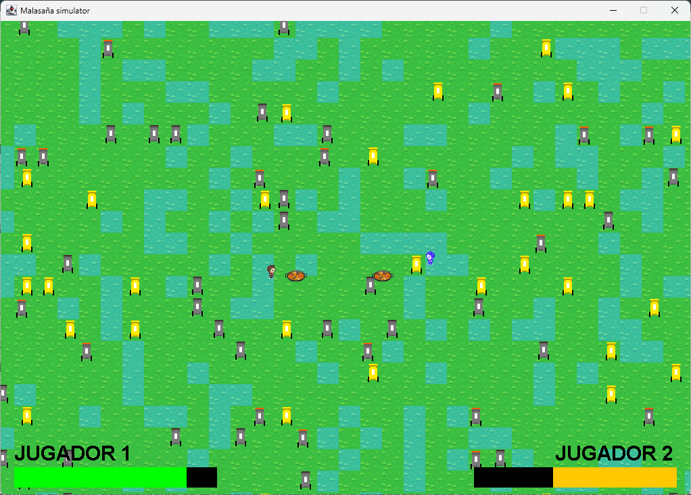
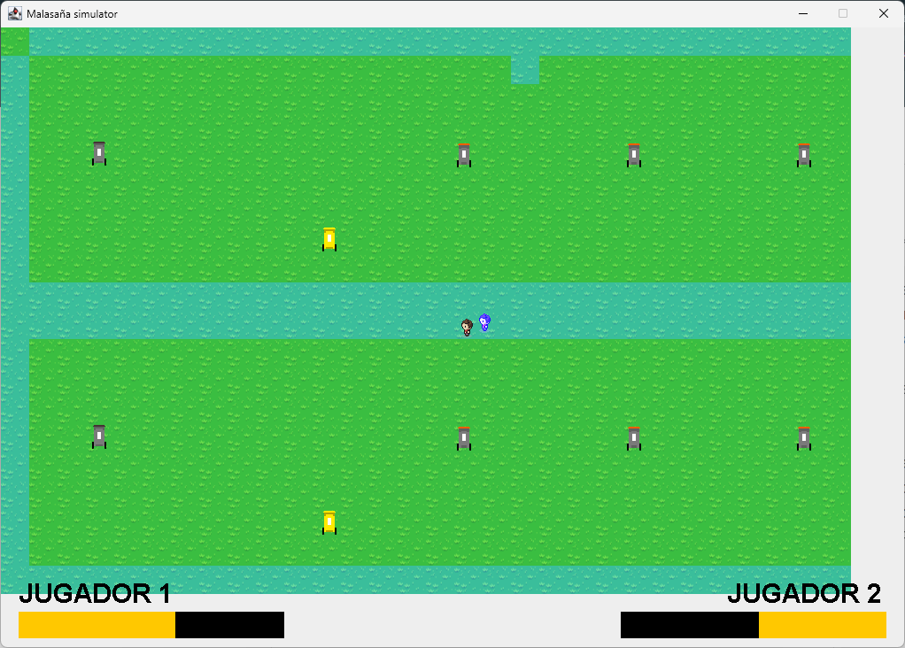

# Kebab vs Bar
[README en Español!](docs/README_es.md)
A game project for a university subject.
The game consists of a battle between a kebab shop owner and a bar owner. It is inspired by the famous Madrid neighborhood of Malasaña.

Map generation works as follows: half the time a random map is generated, and the other half the map will be the one previously defined in the `map2.txt` file.

There are many features that have not been implemented due to lack of time, although the game code is designed to be programmable. These include:
- Add more than two players.
- Add NPCs to multiplayer games.
- There is a texture manager to help implement more tiles, player sprites and bullets.

## Images:
### Start screen:

### 2 Player game

### Singleplayer with NPC in a random map

### Singleplayer with NPC in a previously defined map

### Winner screen
