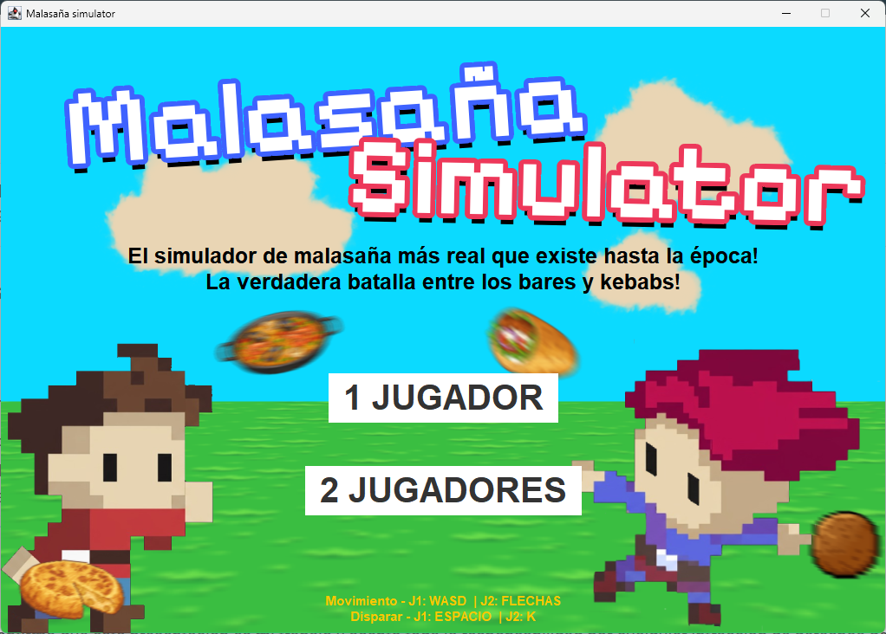
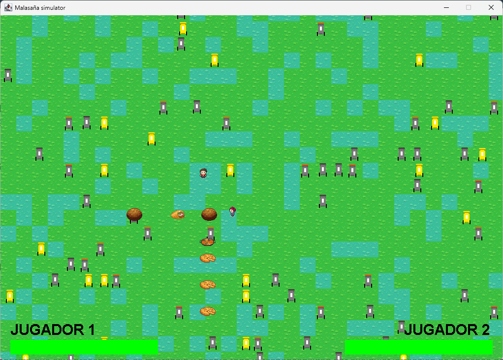
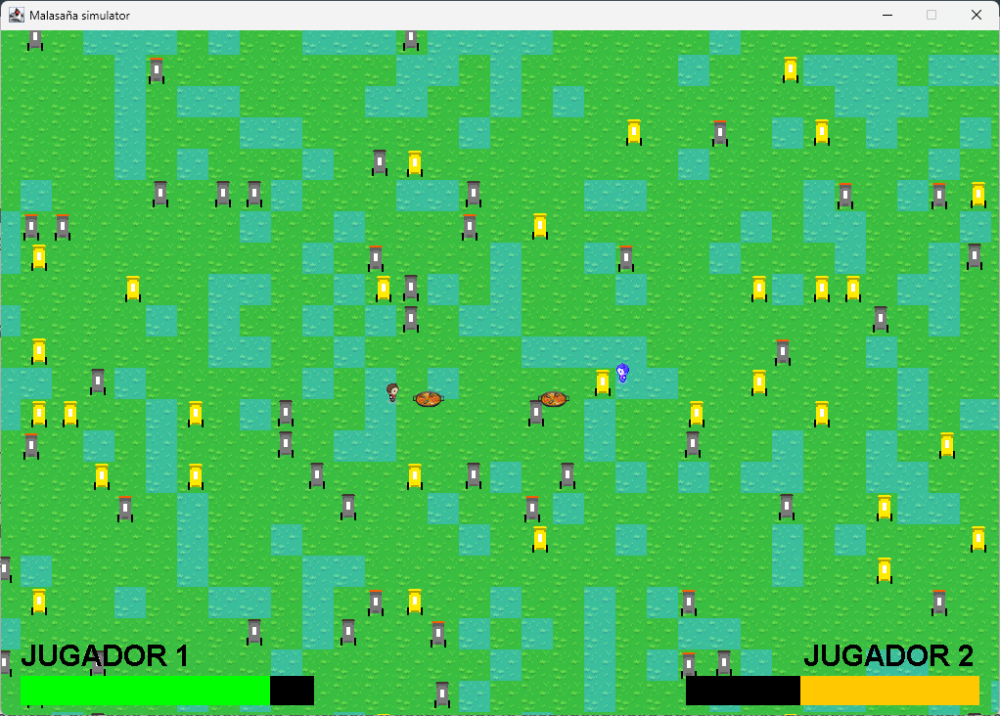
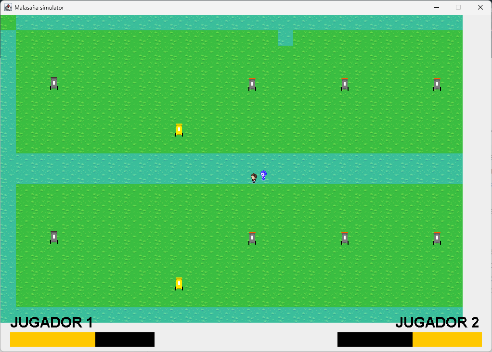
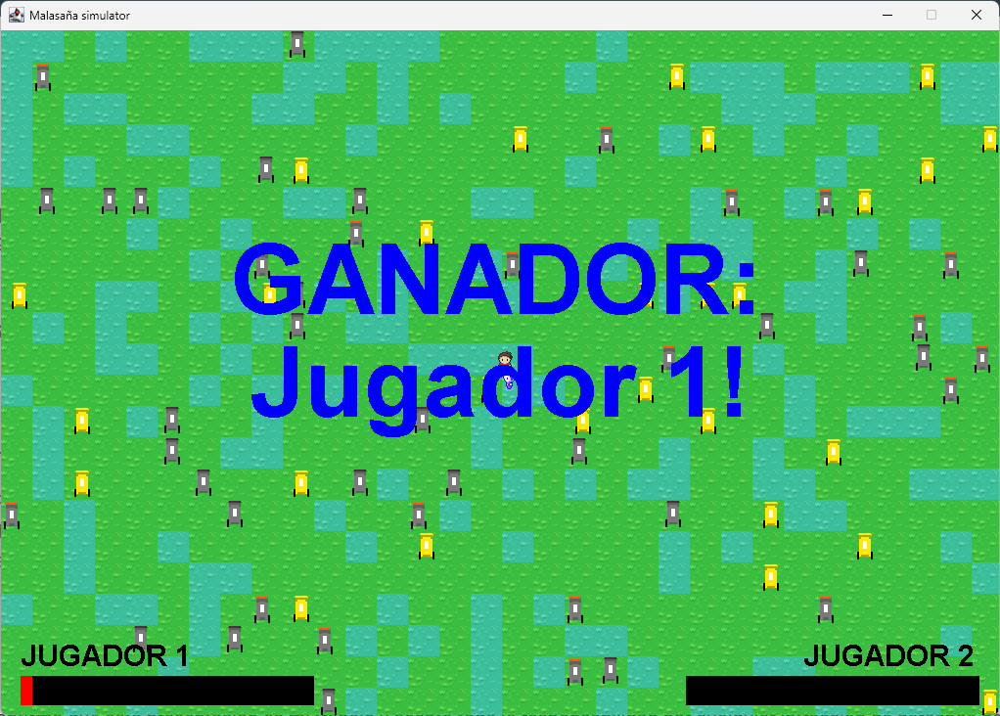

# Un juego para una asignatura de la universidad.
[README in English!](../README.md)
El juego consiste en una batalla entre un dueño de un kebab y un dueño de un bar. Está inspirado en el famoso barrio madrileño malasaña.

La generación de los mapas funciona de la siguiente manera: la mitad de las veces sale un mapa aleatorio y la otra mitad sale un mapa definido previamente en el archivo map2.txt.

Hay muchas funciones que no han sido implantadas aunque el código del juego está pensado para que se puedan programar. Entre ellas están estas funciones:
- Añadir más de 2 jugadores.
- Añadir NPCs a las partidas multijugador.
- Hay un texture manager para facilitar añadir más tiles, sprites y texturas de balas.

## Fotos:
### Pantalla inicial:

### Partida de 2 jugadores

### Partida de un jugador con NPC en un mapa aleatorio

### Partida de un jugador con NPC en un mapa predefinido

### Pantalla de ganador
